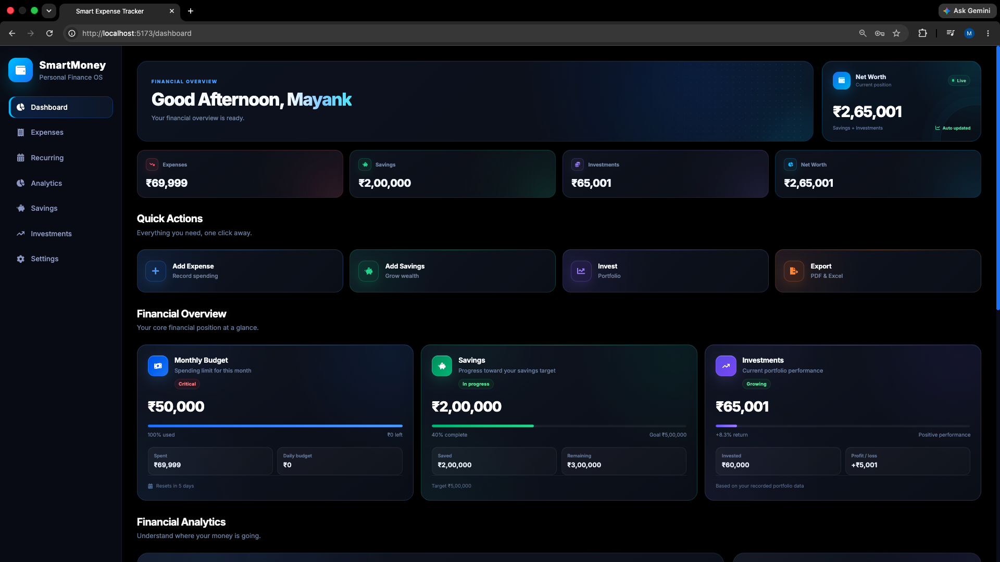
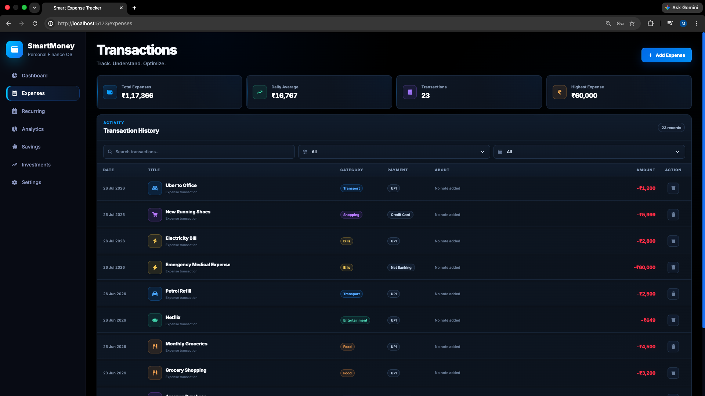
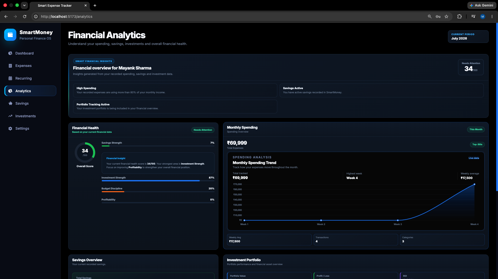
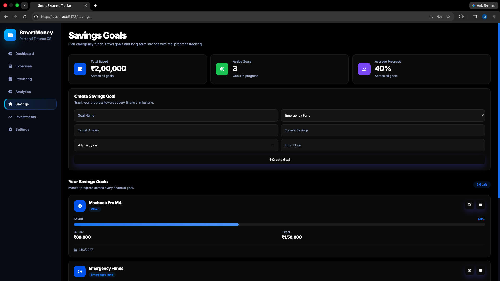
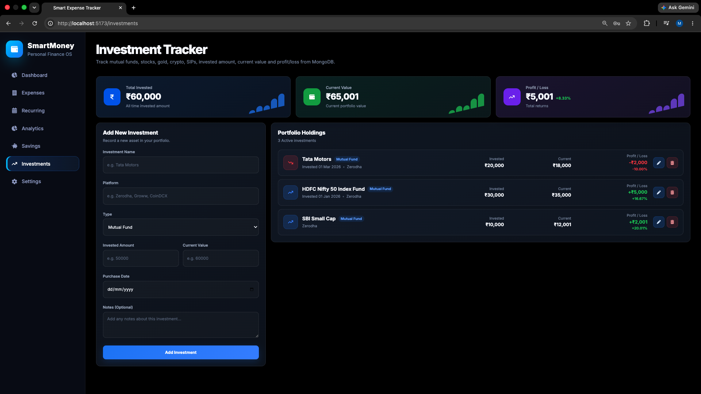
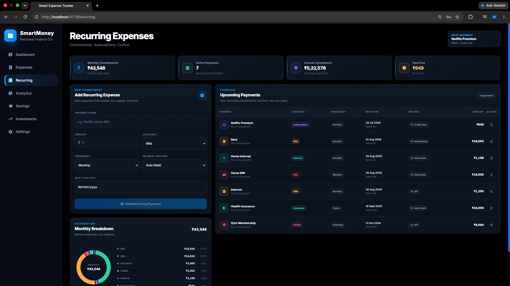
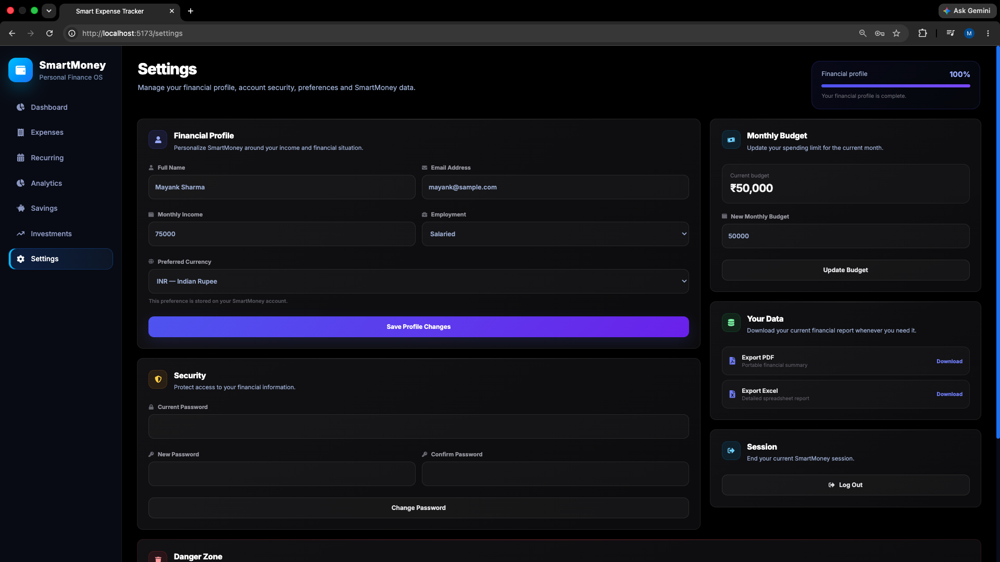

# SmartMoney

SmartMoney is a full-stack personal finance management application built with React, Node.js, Express, and MongoDB.

## Features

- Secure authentication and protected routes
- Expense tracking and categorization
- Monthly budget management
- Savings goals and progress tracking
- Investment portfolio tracking
- Recurring expense management
- Financial analytics and visualizations
- Financial health insights
- PDF and Excel financial report exports
- Responsive premium finance dashboard

## Tech Stack

React, Vite, Node.js, Express.js, MongoDB, Mongoose, JWT, Axios, Recharts, Chart.js, jsPDF, ExcelJS.

## Screenshots

### Dashboard


### Expenses


### Analytics


### Savings


### Investments


### Recurring Expenses


### Settings


## Run Locally

```bash
npm install
npm run dev
```

## Documentation

- [Architecture](docs/01-Architecture.md)
- [Backend](docs/02-Backend.md)
- [Frontend](docs/03-Frontend.md)
- [Database](docs/04-Database.md)
- [API](docs/05-API.md)
- [Roadmap](docs/06-Roadmap.md)

## Author

Mayank Sharma
